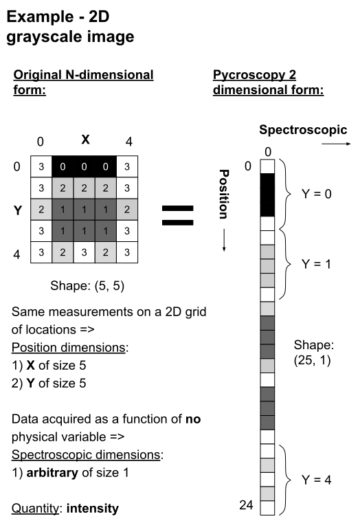
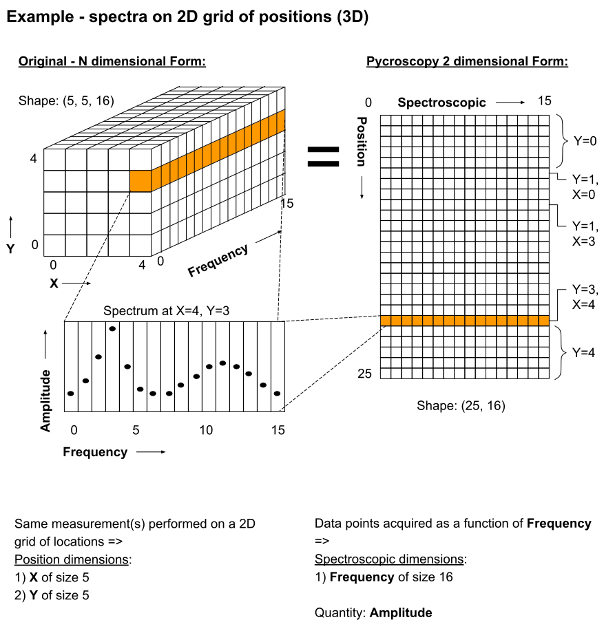

Data Model and File Format
==========================

**Suhas Somnath**

8/8/2017

In this document we aim to provide a comprehensive overview of the motivation for and specifications of the
**Universal Spectroscopy and Imaging Data** (**USID**) Model and the file format (**h5USID**) used for storing
spectroscopy and imaging data.

Pycroscopy uses the **USID** model and **h5USID** files.

**Dr. Stephen Jesse** conceived the **USID** while **Dr. Suhas Somnath** and **Chris R. Smith** implemented **USID**
into hierarchical data format (**HDF5**) files using python in **pyUSID**

.. contents::

Nomenclature
--------------
Before we start off, lets clarify some nomenclature to avoid confusion.

Data model
~~~~~~~~~~~
Data model refers to the way the data is arranged. This does **not** depend on the implementation in a particular file format

File format
~~~~~~~~~~~~
This corresponds to the kind of file, such as a spreadsheet (.CSV), an image (.PNG), a text file (.TXT) within which information is contained.

Data format
~~~~~~~~~~~~
`data format <https://en.wikipedia.org/wiki/Data_format>`_ is actually a rather broad term. However, we have observed that
people often refer to the combination of a data model implemented within a file format as a ``data format``.

Measurements
~~~~~~~~~~~~
In all measurements, some ``quantity`` such as voltage, resistance, current, amplitude, or intensity is collected
as a function of (typically all combinations of) one or more ``independent variables``. For example, a gray-scale image represents the
quantity - intensity being recorded for all combinations of the variables - row and column. A (simple) spectrum represents
a quantity such as amplitude or phase recorded as a function of a reference variable such as wavelength or frequency.

Data collected from measurements result in N-dimensional datasets where each ``dimension`` corresponds to a variable that
was varied. Going back to the above examples a gray-scale image would be represented by a 2 dimensional dataset whose
dimensions are row and column. Similarly, a simple spectrum wold be a 1 dimensional dataset whose sole dimension would
be frequency for example.

Dimensionality
~~~~~~~~~~~~~~~
* We consider data recorded for all combinations of 2 or more variables as ``multi-dimensional`` datasets or ``Nth order tensors``:

  * For example, if a single value of current is recorded as a function of driving / excitation bias or voltage having B values, the dataset is said to be ``1 dimensional`` and the dimension would be - ``Bias``.
  * If the bias is cycled C times, the data is said to be ``two dimensional`` with dimensions - ``(Bias, Cycle)``.
  * If the bias is varied over B values over C cycles at X columns and Y rows in a 2D grid of positions, the resultant dataset would have ``4 dimensions:`` ``(Rows, Columns, Cycle, Bias)``.
* ``Multi-feature``: As a different example, let us suppose that the ``petal width``, ``length``, and ``weight`` were measured for ``F`` different kinds of flowers. This would result in a ``1 dimensional dataset`` with the kind of flower being the sole dimension. Such a dataset is **not** a 3 dimensional dataset because the ``petal width, length``, and ``weight`` are only different ``features`` for each measurement. Some quantity needs to be **measured for all combinations of** petal width, length, and weight to make this dataset 3 dimensional. Most examples observed in data mining, simple machine learning actually fall into this category

Why should you care?
--------------------

The quest for understanding more about matter has necessitated the
development of a multitude of instruments, each capable of numerous
measurement modalities.

Proprietary file formats
~~~~~~~~~~~~~~~~~~~~~~~~~~

Typically, each commercial instruments generates data files formatted in
proprietary file formats by the instrument manufacturer. The proprietary
nature of these file formats and the obfuscated data model within the files impede scientific progress in the
following ways:

#. By making it challenging for researchers to extract data from these files
#. Impeding the correlation of data acquired from different instruments.
#. Inability to store results back into the same file
#. Inflexibility to accommodate few kilobytes to several gigabytes of data
#. Requiring different versions of analysis routines for each data format
#. In some cases, requiring proprietary software provided with the instrument to access the data

Future concerns
~~~~~~~~~~~~~~~~

#. Several fields are moving towards the open science paradigm which will require journals and researchers to support
   journal papers with data and analysis software
#. US Federal agencies that support scientific research require curation of datasets in a clear and organized manner

Other problems
~~~~~~~~~~~~~~~

#. The vast majority of scientific software packages (e.g. X-array) aim to focus at information already available in
   memory. In other words they do not solve the problem of storing data in a self-describing manner and reading +
   processing this data.
#. There are a few file formatting packages and approaches (Nexus, NetCDF). However, they are typically narrow in scope
   and only solve the data formatting for specific communities
#. Commercial image analysis software are often woefully limited in their capabilities and only work on simple 1, 2, and
   in some cases- 3D datasets. There are barely any software for handling arbitrarily large multi-dimensional datasets.
#. In many cases, especially electron and ion based microscopy, the very act of probing the sample damages the sample.
   To minimize damage to the sample, researchers only sample data from a few random positions in the 2D grid and use
   advanced algorithms to reconstruct the missing data. We have not come across any robust solutions for storing such
   **Compressed sensing / sparse sampling** data. More in the **Advanced Topics** section.

Universal Spectroscopy and Imaging Data (USID) Model
------------------------------------------------------

To solve the above and many more problems, we have developed an
**instrument agnostic data model** that can be used to represent data
from any instrument, size, dimensionality, or complexity.

Information in **USID** are stored in three main kinds of datasets:

#. ``Main`` datasets that contain the raw measurements recorded from
   the instrument as well as results from processing or analysis routines
   applied to the data
#. Mandatory ``Ancillary`` datasets that are necessary to explain the
   ``main`` data
#. ``Extra`` datasets store any other data that may be of value

In addition to datasets, the data model is highly reliant on metadata that capture
smaller pieces but critical pieces of information such as the
``quantity`` and ``units`` that describe every data point in the ``main`` dataset.

**We acknowledge that this data model is not trivial to understand at first glance but we are making every effort
to make is simple to understand. If you ever find anything complicated or unclear, please** `write to us <./contact.html>`_
**and we will improve our documentation.**

``Main`` Datasets
~~~~~~~~~~~~~~~~~

Regardless of origin, modality or complexity, imaging data (and most scientific data for that matter) have one
thing in common:

**The same measurement / operation is performed at each spatial position**

The **USID** model is based on this one simple ground-truth.
The data always has some ``spatial dimensions`` (X, Y, Z) and some
``spectroscopic dimensions`` (time, frequency, intensity, wavelength,
temperature, cycle, voltage, etc.). **In USID, the spatial
dimensions are collapsed onto a single dimension and the spectroscopic
dimensions are flattened into the second dimension.** Thus, all data are
stored as **two dimensional arrays**. The data would be arranged in the same manner that
reflects the sequence in which the individual data points were collected. Examples below
will simplify this data-representation paradigm significantly.

In general, if a measurement of length ``P`` was recorded for each of ``N`` positions,
it would be structured as shown in the table below here the prefixes ``i`` correspond to
the positions and ``j`` for spectroscopic:

+------------+------------+------------+--------+--------------+--------------+
| i0, j0     | i0, j1     | i0, j2     | <..>   | i0, jP-2     | i0, jP-1     |
+------------+------------+------------+--------+--------------+--------------+
| i1, j0     | i1, j1     | i1, j2     | <..>   | i1, jP-2     | i1, jP-1     |
+------------+------------+------------+--------+--------------+--------------+
| <......>   | <......>   | <......>   | <..>   | <........>   | <........>   |
+------------+------------+------------+--------+--------------+--------------+
| iN-2, j0   | iN-2, j1   | iN-2, j2   | <..>   | iN-2, jP-2   | iN-2, jP-1   |
+------------+------------+------------+--------+--------------+--------------+
| iN-1, j0   | iN-1, j1   | iN-1, j2   | <..>   | iN-1, jP-1   | iN-1, jP-1   |
+------------+------------+------------+--------+--------------+--------------+

A notion of chronology is attached to both the position and spectroscopic axes.
In other words, the data for the second location (second row in the above table)
was acquired before the first location (first row). The same applies to the spectroscopic axis as well.
This is an important point to remember especially when information is recorded
from multiple sources or channels (e.g. - data from different sensors) or if two or more numbers are **necessary** to
give a particular observation / data point its correct meaning (e.g. - color images).
This point will be clarified via examples that follow.

While the data could indeed be stored in the original N-dimensional form,
there are a few key **advantages to the 2D structuring**:

* The data is already of the **same structure expected by machine learning algorithms** and requires minimal
  to no pre-processing or post-processing. Briefly, the data is simply arranged in the standard form of ``instances x features``,
  where ``instances`` makes up the locations and ``features`` which contains all the observables per entry.
* In certain cases, the data simply **cannot be represented in an N-dimensional form** since one of the dimensions
  has multiple sizes in different contexts.
* Researchers want to acquire ever larger datasets that
  take much longer to acquire. This has necessitated approaches such as
  **sparse sampling** or `compressed sensing
  <https://en.wikipedia.org/wiki/Compressed_sensing>`__ wherein
  measurements are acquired from a few randomly sampled positions and the
  data for the rest of the positions are inferred using complex
  algorithms. Storing such sparse sampled data in the N dimensional form
  would balloon the size of the stored data even though the majority of the
  data is actually empty. Two dimensional datasets would allow the random
  measurements to be written without any empty sections.
* When acquiring measurement data, users often adjust experimental parameters
  during the experiment that may affect the size of the data, especially the
  spectral sizes. Thus, **changes in experimental parameters** would mean that the
  existing N dimensional set would have to be left partially (in most cases
  largely) empty and a new N dimensional dataset would have to be allocated
  with the first few positions left empty. In the case of flattened datasets,
  the current dataset can be truncated at the point of the parameter change
  and a new dataset can be created to start from the current measurement.
  Thus, no space would be wasted.

Here are some examples of how some familiar data can be represented using
this paradigm:

Spectrum
^^^^^^^^

This case encompasses examples such as a **single** Raman spectrum, force-distance curve in
atomic force microscopy, current-voltage spectroscopy, etc. In this case, the measurement is recorded
at a single location meaning that this dataset has a single *arbitrary* ``position dimension``
of size 1. At this position, data is recorded as a
function of a single variable (``spectroscopic dimension``) such as *wavelength* or *frequency*.
Thus, if the spectrum contained ``S`` data points, the **USID** representation of this
data would be a ``1 x S`` matrix. The ``quantity`` represented by this data would be

Gray-scale images
^^^^^^^^^^^^^^^^^

In such data, a single value (``quantity`` is *intensity*) in is recorded
at each location in a two dimensional grid. Thus, there are are two
``position dimensions`` - *X*, *Y*. The value at each pixel was not really acquired
as a function of any variable so the data has one *arbitrary* ``spectroscopic dimension``.
Thus, if the image had ``P`` rows and ``Q`` columns, it would have to be flattened and
represented as a ``P*Q x 1`` array according to the **USID** model. The second
axis has size of 1 since we only record one value (intensity) at each
location. In theory, the flattened data could be arranged column-by-column (as in the figure above)
and then row-by-row or vice-versa depending on how the data was (sequentially)
captured. The sequence in this particular case is debatable in this particular example.

Popular examples of such data include imaging data from raster scans (e.g. - height channel in atomic force microscopy),
black-and-white photographs, scanning electron microscopy (SEM) images. etc.

Color images will be discussed separately below due to some very important subtleties about the
measurement.

Spectral maps
^^^^^^^^^^^^^

If a spectrum of length ``S`` were acquired at each location in a two dimensional grid of positions
with ``P`` rows and ``Q`` columns, it would result in a three dimensional dataset.
This example is a combination of the two examples above. The above 3D dataset has two
``position dimensions`` - *X* and *Y*, and has one ``spectroscopic dimension`` - *Frequency*.
Each data point in the dataset contains the same physical ``quantity`` - *Amplitude*.
In order to represent this 3D dataset in the 2D **USID** form, the two ``position dimensions``
in such data would need to be flattened along the vertical axis and the spectrum at each position
would be laid out along the horizontal axis or the spectroscopic axis.
Thus the original ``P x Q x S`` 3D array would be flattened to a 2D array of shape - ``P*Q x S``.
Assuming that the data was acquired column-by-column and then row-by-row, the rows in the flattened
2D dataset would also be laid out in the same manner: row\ :sub:`0`\ col\ :sub:`0`\ , row\ :sub:`0`\ col\ :sub:`1`\ , row\ :sub:`0`\ col\ :sub:`2`\ ,
... , row\ :sub:`0`\ col\ :sub:`Q`\ , row\ :sub:`1`\ col\ :sub:`0`\ , row\ :sub:`1`\ col\ :sub:`1`\ , ...

Popular examples of such datasets include Scanning Tunnelling Spectroscopy (STS) and
current-voltage spectroscopy

High dimensional data
^^^^^^^^^^^^^^^^^^^^^
This general representation for data was developed to express datasets with 7, 8, 9, or higher dimensional datasets.

The **spectral map** example above only had one ``spectroscopic dimension``. If spectra of length ``S`` were
acquired for ``T`` different *Temperatures*, the resultant dataset would have two ``spectroscopic dimensions`` -
*Frequency* and *Temperature* and would be of shape - ``P x Q x T x S``. Just as the two ``position dimensions``
were flattened along the vertical axis in the example above, now the two spectroscopic dimensions would also need
to be flattened along the horizontal axis. Thus the horizontal axis would be flattend as:
Temperature\ :sub:`0`\ Frequency\ :sub:`0`\ , Temperature\ :sub:`0`\ Frequency\ :sub:`1`\ ,Temperature\ :sub:`0`\ Frequency\ :sub:`2`\ , ...
, Temperature\ :sub:`0`\ Frequency\ :sub:`S`\ , Temperature\ :sub:`1`\ Frequency\ :sub:`0`\ , Temperature\ :sub:`1`\ Frequency\ :sub:`1`\ , ...
This four dimensional dataset would be flattened into a two dimensional array of shape ``P*Q x T*S``.

In the same manner, one could keep adding additional dimensions to either the position or spectroscopic axis.

Non Measurements
^^^^^^^^^^^^^^^^^
This same flattened representation can also be applied to results of data analyses or
data that were not directly recorded from an instrument. Here are some examples:

-  A collection of ``k`` chosen spectra would also be considered
   ``Main`` datasets since the data is still structured as
   ``[instance, features]``
-  Similarly, the centroids obtained from a clustering algorithm like
   ``k-Means clustering``
-  The abundance maps obtained from decomposition algorithms like
   ``Singular Value Decomposition (SVD)`` or
   ``Non-negative matrix factorization (NMF)``

Complicated?
^^^^^^^^^^^^^
This data model may seem unnecessarily complicated for very simple / rigid data such as 2D images or 1D spectra.
However, bear in mind that **this paradigm was designed to represent any information regardless of dimensionality, origin, complexity**, etc.
Thus, encoding data in this manner will allow seamless sharing, exchange, and interpretation of data.

Compound Datasets:
^^^^^^^^^^^^^^^^^^

There are instances where multiple values are associate with a
single position and spectroscopic value in a dataset.  In these cases,
we use the `compound dataset functionality in HDF5 <https://support.hdfgroup.org/HDF5/Tutor/compound.html>`_
to store all of the
values at each point.  This also allows us to access any combination of
the values without needing to read all of them.  Pycroscopy actually uses
compound datasets a lot more frequently than one would think. The need
and utility of compound datasets are best described with examples:

* **Color images**: Each position in these datasets contain three (red,
  blue, green) or four (cyan, black, magenta, yellow) values. One would
  naturally be tempted to simply treat these datasets as ``N x 3`` or ``N x 4``
  datasets, (where ``N`` is the product of the number of *rows* and *columns*
  as in the gray-scale image example above) and it certainly is not wrong
  to represent data this way. However,
  storing the data in this manner would mean that the *red* intensity was
  collected first, followed by the *green*, and finally by the *blue*. In
  other words, **a notion of chronology is attached to both the position
  and spectroscopic axes** according to the **USID** definition.
  While the intensities for each color may be acquired sequentially in
  detectors, since we are not aware of the exact sequence we will assume
  that the *red*, *green*, and *blue* values are acquired simultaneously for
  simultaneously.

  In these cases, we store data using ``compound datasets``
  that allow the storage of multiple pieces of data within the same ``cell``.
  While this may seem confusing or implausible, remember that computers
  store complex numbers in the same way. The complex numbers have a *real*
  and an *imaginary* component just like color images have *red*, *blue*,
  and *green* components that describe a single pixel. Therefore, color
  images in the **USID** representation would be represented by a ``N x 1`` matrix with
  compound values instead of a ``N x 3`` matrix with real or integer values.
  For example, one would refer to the *red* component at a particular position as:

  .. code-block:: python

    red_value = dataset_name[position_index, spectroscopic_index]['red']

* **Functional fits**: Let's take the example of a dataset flattened to shape - ``N x P``,
  whose spectra at each location are fitted to a complicated equation. Now, the ``P``
  points in the spectra will be represented by ``S`` coefficients that don't
  necessarily follow any order. Consequently, the result of the functional
  fit should actually be a ``N x 1`` dataset where each element is a compound
  value made up of the ``S`` coefficients. Note that while some form of sequence
  can be forced onto the coefficients if the spectra were fit to polynomial
  functions, the drawbacks outweigh the benefits:

  * **Slicing**: Storing data in compound datasets circumvents problems associated
    with getting a specific / the ``kth`` coefficient if the data were stored in a
    real-valued matrix instead.
  * **Visualization** also becomes a lot simpler since compound datasets cannot
    be plotted without specifying the component / coefficient of interest. This
    avoids plots with alternating coefficients that are several orders of
    magnitude larger / smaller than each other.

While one could represent multiple channels of information simultaneously acquired by instruments
(for example - height, amplitude, phase channels in atomic force microscopy scan images) using compound datasets,
this is **not** the intended purpose of compound datasets. We use recommend storing each
channel of information separately for consistency across scientific disciplines.
For example, there are modalities in microscopy where some channels provide high
resolution topography data while others provide low-resolution but spectroscopy data.

For more information on compound datasets see the
`h5py Datasets documentation <http://docs.h5py.org/en/latest/high/dataset.html#reading-writing-data>`_
from the HDF Group.

``Ancillary`` Datasets
~~~~~~~~~~~~~~~~~~~~~~

So far we have explained how the (``main``) dataset of interest can be flattened and represented
regardless of its origin, size, dimensionality, etc. In order to make this
``main`` dataset **self-explanatory**, additional pieces of information are required.
For example, while the ``main`` dataset preserves the data of interest, information regarding the
original dimensionality of the data or the combination of parameters corresponding to each
observation is not captured.

In order to capture such vital information, each ``main`` dataset is always accompanied by
**four** ``ancillary`` datasets. These are the:

* The ``Position Values`` and ``Position Indices`` that describe the index and
  value of any given row or spatial position in the ``main`` dataset.
* The ``Spectroscopic Values`` and ``Spectroscopic Indices`` that describe the
  index and values all columns in the ``main`` dataset for all spectroscopic dimensions.

The pair of ``Values`` datasets are analogous to legends for maps. In other words, the pair of
``Values`` datasets **provide the combination of the values for each dimension** / variable
that correspond to a particular data point in the ``main`` dataset. For example, one
would be able to understand readily that a particular data point in the ``main`` dataset
was acquired for the reference values of *Frequency* of 315 kHz, *Temperature* of 400 K
from the ``Spectroscopic Values`` dataset and location *X* of 7.125 microns and *Y* of
480 nanometers from the ``Position Values`` dataset.

The pair of ``Indices`` datasets are essentially **counters for each position
and spectroscopic dimension** / variable. Continuing the example presented for the ``Values``
datasets, let's assume that the data was acquired as a function of all unique combinations of
``37`` *Frequency* values, ``12`` *Temperatures*, ``64`` locations in the *X* direction
and ``128`` values in the *Y* direction. Then, the ``Spectroscopic Indices`` dataset would
instruct that the given data point in the ``main`` dataset corresponds to the ``13th``
*Frequency* value and ``5th`` *Temperature* value. In the same way, the ``Position Indices``
dataset would show that the data point of interest corresponds to the ``47th`` value of *X*
and ``106th`` value of *Y*.

The pair of ``Indices`` datasets are critical for explaining:

* the original dimensionality of the dataset
* how to reshape the data back to its N dimensional form

Much like ``main`` datasets, the ``ancillary`` datasets are also two
dimensional matrices regardless of the number of ``position`` or
``spectroscopic dimensions``. Given a ``main`` dataset with ``N`` positions,
each containing ``P`` spectral values (shape = (``N x P``)), and having
``U`` ``position dimensions`` and  ``V`` ``spectroscopic dimensions``:

* The ``Position Indices`` and ``Position Values`` datasets would both of the
  same size of ``N x U``, where ``U`` is the number of ``position
  dimensions``. The **columns would be arranged in ascending order of rate of
  change**. In other words, the first column would be the fastest changing
  position dimension and the last column would be the slowest. **Each position dimension gets it's own column**.

* The ``Spectroscopic Values`` and ``Spectroscopic Indices`` dataset would
  both be ``V x S`` in shape, where ``V`` is the number of ``spectroscopic
  dimensions``. Similarly to the ``position dimensions``, the first row would be
  the fastest changing ``spectroscopic dimension`` while the last row would be
  the slowest varying dimension. **Each spectroscopic dimension gets it's own row**.

The ``ancillary`` datasets are better illustrated via a few examples. We will
be continuing with the same examples used when illustrating the ``main`` dataset.

Spectrum
^^^^^^^^^
Let's assume that data points were collected as a function of 8 values of the (sole) variable / ``spectroscopic dimension`` -
*Frequency*.  In that case, the ``Spectroscopic Values`` dataset would be of size ``1 x 5`` (one row for the single
``spectroscopic dimension`` and eight columns for each of the reference *Frequency* steps.
Let's assume that the data was collected as a function of *Frequency* over a band ranging from ``300`` to ``320`` kHz.
In that case, the ``Spectroscopic Values`` would be as shown below:

+---------------+-----+-----+-----+-----+-----+
| **Frequency** | 300 | 305 | 310 | 315 | 320 |
+---------------+-----+-----+-----+-----+-----+

This means that for all positions in the ``main`` dataset, the ``4th`` column would always correspond to data collected
for the *Frequency* of ``315 kHz``.

As the name suggests, the ``Spectroscopic Indices`` dataset only shows the indices for the steps in the dimension.
In this particular case, the dataset is trivial and just a linearly increasing array.

Note that indices start from ``0`` instead of ``1`` and
end at ``5-1`` instead of ``5`` in line with common programming languages such as *C* or *python* as shown below:

+---------------+-----+-----+-----+-----+-----+
| **Frequency** | 0   | 1   | 2   | 3   | 4   |
+---------------+-----+-----+-----+-----+-----+

Given that the spectrum only had a single *arbitrary* ``position dimension`` which was varied over a single (arbitrary)
value, the ``Position Indices`` and ``Position Values`` datasets would have a shape of ``1 x 1``.

``Position Indices``:

+----------+
| **arb.** |
+==========+
| 0        |
+----------+

``Position Values``:

+----------+
| **arb.** |
+==========+
| 0.0      |
+----------+

Gray-scale image
^^^^^^^^^^^^^^^^
A simple gray-scale image with ``X`` pixels in the horizontal and ``Y`` pixels in the vertical
direction would have ancillary position
datasets of shape ``X*Y x 2``. The first column in the ancillary position
datasets would correspond to the index / values of the dimension - ``X``
(assuming that it is the dimension that varies fastest)
and the second column in the ancillary position dataset would be the dimension - ``Y``
assuming that the data was collected column-by-column and then row-by-row just as in the example above.

If the original image had 3 pixels in the horizontal direction and 2 pixels in the vertical direction,
the corresponding ``Position Indices`` dataset would be:

+-------+-----+
|   X   | Y   |
+=======+=====+
| 0     | 0   |
+-------+-----+
| 1     | 0   |
+-------+-----+
| 2     | 0   |
+-------+-----+
| 0     | 1   |
+-------+-----+
| 1     | 1   |
+-------+-----+
| 2     | 1   |
+-------+-----+

Notice that the index for ``X`` is reset to ``0`` when ``Y`` is incremented from ``0`` to ``1`` in the fourth row.
As mentioned earlier, the data in such ``Indices`` datasets are essentially counters.

Correspondingly, if the measurements were performed at ``X`` locations:
``0.0, 1.5, and 3.0`` *microns* and ``Y`` locations: ``-70`` and ``23`` *nanometers*,
the ``Position Values`` dataset may look like the table below:

+----------+-----------+
| X        | Y         |
+==========+===========+
| 0.0      | -70.0     |
+----------+-----------+
| 1.5      | -70.0     |
+----------+-----------+
| 3.0      | -70.0     |
+----------+-----------+
| 0.0      | 23.0      |
+----------+-----------+
| 1.5      | 23.0      |
+----------+-----------+
| 3.0      | 23.0      |
+----------+-----------+

Thus, the ``5th`` row in the ``main dataset`` for this gray-scale image would correspond to data collected
at ``X = 1.5 microns`` and ``Y = 23 nanometers`` according to the ``Position Values`` dataset.

Note that ``X`` and ``Y`` dimensions have **different units** - microns and nanometers.
Pycroscopy has been designed to handle variations in the units for
each of these dimensions. Details regarding how and where to store
the information regarding the ``labels`` ('X', 'Y') and ``units`` for
these dimensions ('um', 'nm') will be discussed in the ``Implementation`` section.

Similar to the ``position dimensions`` for a spectrum, gray-scale images only have a single *arbitrary*
``spectroscopic dimension``. Thus, both ``Spectroscopic`` datasets have shape of ``1 x 1``:

``Spectroscopic Indices``:

+-----------+-----+
| **arb.**  | 0   |
+-----------+-----+

``Spectroscopic Values``:

+-----------+-----+
| **arb.**  | 0   |
+-----------+-----+

Spectral maps
^^^^^^^^^^^^^
Let's continue the example on **spectral maps**, which has two ``position
dimensions`` - *X* and *Y*, and one ``spectroscopic dimension`` - *Frequency*.
If the dataset was varied over ``3`` values of *X*, ``2`` values of *Y* and ``5`` values of *Frequency*, the
``ancillary`` datasets would be based on the solutions for the two examples above:

``Position Indices``:

+-------+-----+
|   X   | Y   |
+=======+=====+
| 0     | 0   |
+-------+-----+
| 1     | 0   |
+-------+-----+
| 2     | 0   |
+-------+-----+
| 0     | 1   |
+-------+-----+
| 1     | 1   |
+-------+-----+
| 2     | 1   |
+-------+-----+

``Position Values``:

+----------+-----------+
| X        | Y         |
+==========+===========+
| 0.0      | -70.0     |
+----------+-----------+
| 1.5      | -70.0     |
+----------+-----------+
| 3.0      | -70.0     |
+----------+-----------+
| 0.0      | 23.0      |
+----------+-----------+
| 1.5      | 23.0      |
+----------+-----------+
| 3.0      | 23.0      |
+----------+-----------+

``Spectroscopic Indices``:

+---------------+-----+-----+-----+-----+-----+
| **Frequency** | 0   | 1   | 2   | 3   | 4   |
+---------------+-----+-----+-----+-----+-----+

``Spectroscopic Values``:

+---------------+-----+-----+-----+-----+-----+
| **Frequency** | 300 | 305 | 310 | 315 | 320 |
+---------------+-----+-----+-----+-----+-----+

High dimensional data
^^^^^^^^^^^^^^^^^^^^^
Continuing with the expansion of the **spectral maps** example - if the data was recorded as a function of ``3``
*Temperatures* in addition to recording data as a function of *Frequency* as in the above example, we wold have two
``spectroscopic dimensions`` - *Frequency*, and *Temperature*. Thus, the ``ancillary spectroscopic`` datasets would
now have a shape of ``2 x 5*3`` instead of the simpler ``1 x 5``. The value ``2`` on the first index corresponds to
the two ``spectroscopic dimensions`` and the longer (``15`` instead of ``5``) second axis corresponds to the fact
that the spectra is now recorded thrice at each position (once for each *Frequency*). Assuming that the *Frequency*
varies faster than the *Temperature* dimension (i.e.- the *Frequency* is varied from ``300`` to ``320`` for a
*Temperature* of ``30 C``, **then** the *Frequency* is varied from ``300`` to ``320`` for a *Temperature* of ``40 C``
and so on), the ``Spectroscopic Indices`` would be as follows:

+-----------------+-----+-----+-----+-----+-----+-----+-----+-----+-----+-----+-----+-----+-----+-----+-----+
| **Frequency**   | 0   | 1   | 2   | 3   | 4   | 0   | 1   | 2   | 3   | 4   | 0   | 1   | 2   | 3   | 4   |
+-----------------+-----+-----+-----+-----+-----+-----+-----+-----+-----+-----+-----+-----+-----+-----+-----+
| **Temperature** | 0   | 0   | 0   | 0   | 0   | 1   | 1   | 1   | 1   | 1   | 2   | 2   | 2   | 2   | 2   |
+-----------------+-----+-----+-----+-----+-----+-----+-----+-----+-----+-----+-----+-----+-----+-----+-----+

Correspondingly, the ``Spectroscopic Values`` would look like:

+-----------------+-----+-----+-----+-----+-----+-----+-----+-----+-----+-----+-----+-----+-----+-----+-----+
| **Frequency**   | 300 | 305 | 310 | 315 | 320 | 300 | 305 | 310 | 315 | 320 | 300 | 305 | 310 | 315 | 320 |
+-----------------+-----+-----+-----+-----+-----+-----+-----+-----+-----+-----+-----+-----+-----+-----+-----+
| **Temperature** | 30  | 30  | 30  | 30  | 30  | 40  | 40  | 40  | 40  | 40  | 50  | 50  | 50  | 50  | 50  |
+-----------------+-----+-----+-----+-----+-----+-----+-----+-----+-----+-----+-----+-----+-----+-----+-----+

Since the manner and values over which the positions are varied remains unchanged from the *spectral maps* example,
the ``Position Indices`` and ``Position Values`` datasets for this example would be identical those of the *spectral maps* example

A simple glance at the shape of the ``ancillary`` datasets for this (or any) example would be enough to
reveal that the data has two ``position dimensions`` (two columns in the ``Position Indices`` dataset) and
two ``spectroscopic dimensions`` (two rows in the ``Spectroscopic Indices`` dataset)
dataset)

In the same manner, additional dimensions can be added to the ``main`` and appropriate ``ancillary`` datasets
thus proving that this data model can indeed accommodate data of any size, complexity, or dimensionality.

Channels
~~~~~~~~~
The **USID** model also allows the representation and capture of **information acquired
simultaneously from multiple sources** through ``Channels``.
Each ``Channel`` would contain a **separate** ``main`` dataset. ``Ancillary`` datasets
can be shared across channels if the position or spectroscopic dimensions are identical.

As alluded to earlier, the most popular example many people can relate to are the various channels
of information recorded during a conventional scanning probe microscopy raster scan (*Height*, *Amplitude*, *Phase*).
For this example, all the ``channels`` could share the same set of four ``ancillary`` datasets.

It is not necessary that rate of acquisition match across ``channels``. For example, one
``channel`` could be a high-resolution topography scan (similar to 2D gray-scale image)
while another ``channel`` could contain spectra collected at each location on a
**coarser** grid of positions (3D spectral-map dataset). In this case, the two
``channels`` may not be able to share ``ancillary`` datasets.

Specifics regarding the implementation of different
channels will be discussed in a later section.

File Format
-------------

Requirements
~~~~~~~~~~~~~~
No one really wants yet another file format in their lives. We wanted to adopt a file format that satisfies some basic requirements:

* already widely accepted in scientific research
* support parallel read and write capabilities.
* store multiple datasets of different shapes, dimensionalities, precision and sizes.
* scale very efficiently from few kilobytes to several terabytes
* can be (readily) read and modified using any language including Python, R, Matlab,
  C/C++, Java, Fortran, Igor Pro, etc. without requiring installation of modules that are hard to install
* store and organize data in a intuitive and familiar hierarchical / tree-like
  structure that is similar to files and folders in personal computers.
* facilitates storage of any number of experimental or analysis parameters
  in addition to regular data.
* highly flexible and poses minimal restrictions on how the data can and should be stored.
* readily compatible with high-performance computing (``HPC``) and (soon) cloud-computing.

Candidates
~~~~~~~~~~~~
* We found that existing file formats in science such as the `Nexus data format <http://www.nexusformat.org>`_,
  `XDMF <http://www.xdmf.org/index.php/Main_Page>`_, and `NetCDF <https://www.unidata.ucar.edu/software/netcdf/>`_:

  * were designed for **specific / narrow scientific domains only** and we did not want to shoehorn our data structure into those formats.
  * Furthermore, despite being some of the more popular scientific data formats, it is **not immediately straightforward to read those files**
    on every computer using any programming language. For example - the `Anaconda <https://www.anaconda.com/what-is-anaconda/>`_
    python distribution does not come with any packages for reading these file formats.
* `Adios <https://www.olcf.ornl.gov/center-projects/adios/>`_ is perhaps the ultimate file format for storing petabyte sized data on supercomputers but
  it was specifically designed for simulations, check-pointing, and it trades flexibility, and ease-of-use for performance.
* The `hierarchical data format (HDF5) <https://support.hdfgroup.org/HDF5/doc/H5.intro.html>`_ is the implicitly or explicitly the
  `de-facto standard in scientific research <https://support.hdfgroup.org/HDF5/users5.html>`_.
  In fact, Nexus, NetCDF, and even `Matlab's .mat <https://www.mathworks.com/help/matlab/import_export/mat-file-versions.html>`_
  files are actually (now) just custom flavors of HDF5 thereby validating the statement that HDF5 is the **unanimous the file format of choice**
* The `DREAM.3D <http://dream3d.bluequartz.net/binaries/Help/DREAM3D/nativedream3d.html>`_ is yet another group that uses HDF5
  as the base container to store their data. We are currently evaluating compatibility with and feasibility of their data model.

We found that `HDF5 <http://extremecomputingtraining.anl.gov/files/2015/03/HDF5-Intro-aug7-130.pdf>`_, works best for us compared to the alternatives.
Hence, we have implemented the **USID** model into the HDF5 file format and such file will be referred to as **h5USID** files.

We acknowledge that it is nearly impossible to find the perfect file format and HDF5 too has its fair share of drawbacks.
One common observation among file formats is that a file format optimized for the cloud or cluster computing often does
not perform well (or at all) on HPC due to the conflicting nature of the computing paradigms.
As of this writing, HDF5 is optimized for HPC and not for cloud-based applications.
For cloud-based environments it is beneficial to in fact break up the data into
small chunks that can be individually addressed and used. We think `Zarr <https://zarr.readthedocs.io/en/stable/>`_ and
`N5 <https://github.com/saalfeldlab/n5>`_ would be good alternatives; however, most of these file formats are very much in
their infancy and have not proven themselves like HDF5 has. This being said, the HDF organization
`just announced <https://www.youtube.com/watch?v=3tP3lT5y-QA>`_ a `cloud flavor <https://www.hdfgroup.org/solutions/hdf-cloud/>`_
of HDF5 and we plan to look into this once h5py or other python packages support such capabilities.

h5USID - USID in HDF5
-----------------------

Here we discuss guidelines and specifications for implementing the **USID** model into HDF5 files.
While we could impose that the file extension be changed from **.hdf5** to **.h5USID**, we choose to retain
the **.hdf5** extension so that other software are aware of the general file type and can recognize / read them easily.

Quick basics of HDF5
~~~~~~~~~~~~~~~~~~~~~
Information can be stored in HDF5 files in several ways:

* ``Datasets`` allow the storage of data matrices and these are the vessels used for storing the ``main``,
  ``ancillary``, and any extra data matrices
* ``Groups`` are similar to folders in conventional file systems and can be used to store any number of datasets or
  groups themselves
* ``Attributes`` are small pieces of information, such as experimental or analytical parameters, that are stored in
  key-value pairs in the same way as dictionaries in python.  Both groups and datasets can store attributes.
* While they are not means to store data, ``Links`` or ``references`` can be used to provide shortcuts and aliases to
  datasets and groups. This feature is especially useful for avoiding duplication of datasets when two ``main``
  datasets use the same ancillary datasets.

``Main`` data:
~~~~~~~~~~~~~~

**Dataset** structured as (positions x time or spectroscopic values)

* ``dtype`` : uint8, float32, complex64, compound if necessary, etc.
* *Required* attributes:

  * ``quantity`` - Single string that explains the data. The physical
    quantity contained in each cell of the dataset – eg –
    'Current' or 'Deflection'
  * ``units`` – Single string for units. The units for the physical
    quantity like 'nA', 'V', 'pF', etc.
  * ``Position_Indices`` - Reference to the position indices dataset
  * ``Position_Values`` - Reference to the position values dataset
  * ``Spectroscopic_Indices`` - Reference to the spectroscopic indices
    dataset
  * ``Spectroscopic_Values`` - Reference to the spectroscopic values
    dataset

* `chunking <https://support.hdfgroup.org/HDF5/doc1.8/Advanced/Chunking/index.html>`__
  : HDF group recommends that chunks be between 100 kB to 1 MB. We
  recommend chunking by whole number of positions since data is more
  likely to be read by position rather than by specific spectral indices.

Note that we are only storing references to the ancillary datasets. This
allows multiple ``main`` datasets to share the same ancillary datasets
without having to duplicate them.

``Ancillary`` data:
~~~~~~~~~~~~~~~~~~~

``Position_Indices`` structured as (``positions`` x ``spatial dimensions``)

* dimensions are arranged in ascending order of rate of change. In other
  words, the fastest changing dimension is in the first column and the
  slowest is in the last or rightmost column.
* ``dtype`` : uint32
* Required attributes:

  * ``labels`` - list of strings for the column names like ['X', 'Y']
  * ``units`` – list of strings for units like ['um', 'nm']

* Optional attributes:
  * Region references based on column names

``Position_Values`` structured as (``positions`` x ``spatial dimensions``)

* dimensions are arranged in ascending order of rate of change. In other
  words, the fastest changing dimension is in the first column and the
  slowest is in the last or rightmost column.
* ``dtype`` : float32
* Required attributes:

  * ``labels`` - list of strings for the column names like ['X', 'Y']
  * ``units`` – list of strings for units like ['um', 'nm']

* Optional attributes:
  * Region references based on column names

``Spectroscopic_Indices`` structured as (``spectroscopic dimensions`` x
``time``)

* dimensions are arranged in ascending order of rate of change.
  In other words, the fastest changing dimension is in the first row and
  the slowest is in the last or lowermost row.
* ``dtype`` : uint32
* Required attributes:

  * ``labels`` - list of strings for the column names like ['Bias', 'Cycle']
  * ``units`` – list of strings for units like ['V', ''].
    Empty string for dimensionless quantities

* Optional attributes:
  * Region references based on row names

``Spectroscopic_Values`` structured as (``spectroscopic dimensions`` x
``time``)

* dimensions are arranged in ascending order of rate of change.
  In other words, the fastest changing dimension is in the first row and
  the slowest is in the last or lowermost row.
* ``dtype`` : float32
* Required attributes:

  * ``labels`` - list of strings for the column names like ['Bias', 'Cycle']
  * ``units`` – list of strings for units like ['V', ''].
    Empty string for dimensionless quantities

* Optional attributes:

  * Region references based on row names

Attributes
~~~~~~~~~~
All groups and (at least ``Main``) datasets must be created with the following **mandatory** attributes for better traceability:

-  ``time_stamp`` : '2017\_08\_15-22\_15\_45' (date and time of creation
   of the group or dataset formatted as 'YYYY\_MM\_DD-HH\_mm\_ss' as
   a string)
-  ``machine_id`` : 'mac1234.ornl.gov' (a fully qualified domain name as
   a string)
-  ``pycroscopy_version`` : '0.60.0'
-  ``platform`` : 'Windows10....' or something like 'Darwin-17.4.0-x86_64-i386-64bit' (for Mac OS) -
   a long string providing detailed information about the operating system

Groups
~~~~~~~~~~

HDF5 Groups in **h5USID** are used to organize categories of information (raw measurements from instruments, results from data analysis, etc.) in an intuitive manner.

Measurement data
^^^^^^^^^^^^^^^^

-  As mentioned earlier, instrument users may change experimental
   parameters during measurements. Even if these changes are minor, they
   can lead to misinterpretation of data if the changes are not handled
   robustly. To solve this problem, we recommend storing data under **indexed**
   groups named as ``Measurement_00x``. Each time the parameters
   are changed, the dataset is truncated to the point until which data
   was collected and a new group is created to store the upcoming
   new measurement data.
-  Each **channel** of information acquired during the measurement gets
   its own group.
-  The ``Main`` datasets would reside within these channel groups.
-  Similar to the measurement groups, the channel groups are
   named as ``Channel_00x``. The index for the group is incremented
   according to the index of the information channel.
-  Depending on the circumstances, the ancillary datasets can be shared
   among channels.

   -  Instead of the main dataset in ``Channel_001`` having references to
      the ancillary datasets in ``Channel_000``, we recommend placing the
      ancillary datasets outside the Channel groups in a area common
      to both channel groups. Typically, this is the
      ``Measurement_00x`` group.

-  This is what the tree structure in the file looks like when
   experimental parameters were changed twice and there are two channels
   of information being acquired during the measurements.
-  Datasets common to all measurement groups (perhaps some calibration
   data that is acquired only once before all measurements)
-  ``Measurement_000`` (group)

   -  ``Channel_000`` (group)

      -  Datasets here

   -  ``Channel_001`` (group)

      -  Datasets here

   -  Datasets common to ``Channel_000`` and ``Channel_001``

-  ``Measurement_001`` (group)

   -  ``Channel_000`` (group)

      -  Datasets here

   -  ``Channel_001`` (group)

      -  Datasets here

   -  Datasets common to ``Channel_000`` and ``Channel_001``

-  ...

Tool (analysis / processing)
^^^^^^^^^^^^^^^^^^^^^^^^^^^^

-  Each time an analysis or processing routine, referred generally as
   ``tool``, is performed on a dataset of interest, the results are
   stored in new HDF5 datasets within a new HSF5 group.
-  A completely new dataset(s) and group are created even if a minor
   operation is being performed on the dataset. In other words, we **do NOT modify existing datasets**.
-  Almost always, the tool is applied to one (or more) ``main`` datasets (referred to
   as the ``source`` dataset) and at least one of the results is
   typically also a ``main`` dataset. These new ``main`` datasets will
   either need to be linked to the ancillary matrices of the ``source``
   or to new ancillary datasets that will need to be created.
-  The resultant dataset(s) are always stored in a group whose name
   is derived from the names of the tool and the dataset. This makes the
   data **traceable**, meaning that the names of the datasets and
   groups are sufficient to understand what processing or analysis
   steps were applied to the data to bring it to a particular point.
-  The group is named as ``Source_Dataset-Tool_Name_00x``, where a
   ``tool`` named ``Tool_Name`` is applied to a ``main`` dataset named
   ``Source_Dataset``.

   -  Since there is a possibility that the same tool could be applied
      to the very same dataset multiple times, we store the results of
      each run of the tool in a separate group. These groups are
      differentiated by the index that is appended to the name of
      the group.
   -  Note that a ``-`` separates the dataset name from the tool name
      and anything after the last ``_`` will be assumed to be the index
      of the group
   -  Please refer to the advanced topics section for tools that have **more than one**
      ``source`` datasets

-  In general, the results from tools applied to datasets should be
   stored as:

    -  ``Source_Dataset``
    -  ``Source_Dataset-Tool_Name_000`` (group containing results from
       first run of the ``tool`` on ``Source_Dataset``)

       -  Attributes:

          -  all mandatory attributes
          -  ``algorithm``
          -  Other tool-relevant attributes
          -  ``source_000`` - reference to ``Source_Dataset``

       -  ``Dataset_Result0``
       -  ``Dataset_Result1`` ...

    -  ``Source_Dataset-Tool_Name_001`` (group containing results from
       second run of the ``tool`` on ``Source_Dataset``)

-  This methodology is illustrated with an example of applying
   ``K-Means Clustering`` on the ``Raw_Data`` acquired from a measurement:

    -  ``Raw_Data`` (``main`` dataset)
    -  ``Raw_Data-Cluster_000`` (group)
    -  Attributes:

           -  all mandatory attributes
           -  ``algorithm`` : 'K-Means'
           -  ``source_000`` : reference to ``Raw_Data``

    -  ``Label_Indices`` (ancillary spectroscopic dataset with 1 dimension of size 1)
    -  ``Label_Values`` (ancillary spectroscopic dataset with 1 dimension of size 1)
    -  ``Labels`` (Main dataset)

       -  Attributes:

          -  ``quantity`` : 'Cluster labels'
          -  ``units`` : 'a. u.'
          -  ``Position_Indices`` : Reference to ``Position_Indices`` from
             attribute of ``Raw_Data``
          -  ``Position_Values`` : Reference to ``Position_Values`` from
             attribute of ``Raw_Data``
          -  ``Spectroscopic_Indices`` : Reference to ``Label_Indices``
          -  ``Spectroscopic_Values`` : Reference to ``Label_Values``
          -  all mandatory attributes

    -  ``Cluster_Indices`` (ancillary positions dataset with 1 dimension of size equal to number of clusters)
    -  ``Cluster_Values`` (ancillary positions dataset with 1 dimension of size equal to number of clusters)
    -  ``Mean_Response`` (main dataset) <- This dataset stores the endmembers
       or mean response for each cluster

       -  Attributes:

          -  ``quantity`` : copy from the ``quantity`` attribute in
             ``Raw_Data``
          -  ``units`` : copy from the ``units`` attribute in ``Raw_Data``
          -  ``Position_Indices`` : Reference to ``Cluster_Indices``
          -  ``Position_Values`` : Reference to ``Cluster_Values``
          -  ``Spectroscopic_Indices`` : Reference to ``Spectroscopic_Indices``
             from attribute of ``Raw_Data``
          -  ``Spectroscopic_Values`` : Reference to ``Spectroscopic_Values``
             from attribute of ``Raw_Data``
          -  all mandatory attributes

-  Note that the spectroscopic datasets that the ``Labels`` dataset link
   to are not called ``Spectroscopic_Indices`` or
   ``Spectroscopic_Values`` themselves. They only need to follow the
   specifications outlined above. The same is true for the position
   datasets for ``Mean_Response``.

Advanced topics
----------------

``Region references``
~~~~~~~~~~~~~~~~~~~~~~
These are references to sections of a ``main`` or ``ancillary`` dataset that make it easy to access data specific to a
specific portion of the measurement, or each column or row in the ancillary datasets just by their alias (intuitive
strings for names).

We have observed that the average **USID** user does not tend to use region references as much as we thought they
might. Therefore, we do not require or enforce that region references be used

Processing on multiple ``Main`` datasets
~~~~~~~~~~~~~~~~~~~~~~~~~~~~~~~~~~~~~~~~~
One popular scientific workflow we anticipate involves the usage of multiple ``source`` datasets to create results.
By definition, this breaks the current nomenclature of HDF5 groups that will contain results. This will be addressed by
restructuring the code in such a way that the results group could be named as: ``Multi_Dataset-Tool_Name_000``. To improve
the robustness of the solution, we have already begun storing the necessary information as attributes of the HDF5
results groups. Here are the attributes of the group that we expect to capture the references to all the datasets along
with the name of the tool while relaxing the restrictions on the aforementioned nomenclature:

* ``tool`` : <string> - Name of the tool / process applied to the datasets
* ``num_sources``: <unsigned integer> - Number of source datasets that take part in the process
* ``source_000`` : <HDF5 object reference> - reference to the first source dataset
* ``source_001`` : <HDF5 object reference> - reference to the second source dataset ...

We would have to break the list of references to the source datasets into individual attributes since h5py / HDF5
currently does not allow the value of an attribute to be a list of object references.

Sparse Sampling / Compressed Sensing
~~~~~~~~~~~~~~~~~~~~~~~~~~~~~~~~~~~~~
In many cases, especially electron and ion based microscopy, the very act of probing the sample damages the sample.
In order to minimize damage to the sample, researchers only sample data from a few random positions in the 2D grid of
positions and use advanced algorithms to reconstruct the missing data. This scientific problem presents a data storage
challenge. The naive approach would be to store a giant matrix of zeros with only a available positions filled in.
This is highly inefficient since the space occupied by the data would be equal to that of the complete (non-sparse)
dataset.

For such sparse sampling problems, we propose that the indices for each position be identical and still range from ``0``
to ``N-1`` for a dataset with ``N`` randomly sampled positions. Thus, for an example dataset with two position dimensions,
the indices would be arranged as:

+-------+-------+
|   X   |   Y   |
+=======+=======+
|  0    |   0   |
+-------+-------+
|  1    |   1   |
+-------+-------+
|  2    |   2   |
+-------+-------+
|  .    |   .   |
+-------+-------+
|  N-2  |  N-2  |
+-------+-------+
|  N-1  |  N-1  |
+-------+-------+

However, the position values would contain the actual values:

+-------+-------+
|   X   |   Y   |
+=======+=======+
|  9.5  |  1.5  |
+-------+-------+
|  3.6  |  7.4  |
+-------+-------+
|  5.4  |  8.2  |
+-------+-------+
|  .    |   .   |
+-------+-------+
|  1.2  |  3.9  |
+-------+-------+
|  4.8  |  6.1  |
+-------+-------+

The spectroscopic ancillary datasets would be constructed and defined in the traditional methods since the sampling in
the spectroscopic dimension is identical for all measurements.

The vast majority of the existing features including signal filtering, statistical machine learning algorithms, etc. in
pycroscopy could still be applied to such datasets.

By nature of its definition, such a dataset will certainly pose problems when attempting to reshape to its N-dimensional
form among other things. Pycroscopy currently does not have any scientific algorithms or real datasets specifically
written for such data but this will be addressed in the near future. This is section is presented to show that we
have indeed thought about such advanced problems as well when designing the universal data structure.
